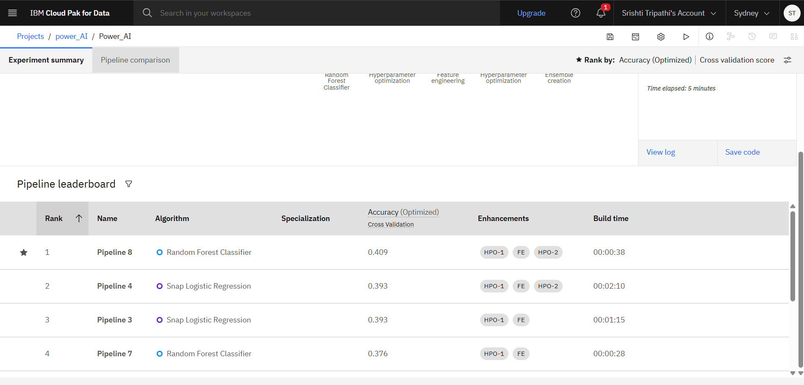

# Power-System-Fault-Detection-and-Classification

### Problem Statement
Power distribution systems are prone to various faults due to environmental, equipment, or operational failures. These faults can lead to blackouts, equipment damage, or system instability. Current methods for fault detection are often slow, manual, or rule-based, lacking the intelligence for real-time classification. There is a critical need for automated and accurate fault detection and classification to ensure grid reliability, safety, and quick restoration.

### Proposed Solution
 - Data Collection.
    - Real-time or historic phasor measurement data (voltage, current, angle).
    - Uploaded and organized in IBM Cloud Object Storage.

- Data Preprocessing (in Watson Studio)
    - Cleaning missing values, outliers.
    - Feature extraction (e.g., RMS, zero/positive/negative sequence components).
    - Scaling and normalization for ML compatibility.
    - Stored intermediate files in IBM Cloud Object Storage for reproducibility.
      
 - Model Training (Watson Machine Learning)
     - Algorithms considered:
     - Random Forest Classifier
     - SVM
     - Logistic Regression
     - AutoAI : Automatically compares and selects the best-performing model.
     - Training and validation performed using cross-validation.
       
 - Model Deployment
     - Deployed as REST API using Watson Machine Learning Service.
     - Webhook notifications or alerts can be generated using IBM Cloud Functions

### Result

